# System Flow Chart - Conditional UserConfig Handling + File Cleanup

This diagram shows the complete system flow with conditional UserConfig handling in SubmitData transactions, including automated seed file deletion from the file storage platform after rating completion.

```mermaid
flowchart TD
    %% User and Frontend Flow
    A[👤 User] -->|1\. Upload Seed File| B[🌐 Frontend]
    B -->|2\. Send File| C[🔧 Backend API]
    
    %% Backend Processing (Non-Critical Data)
    C -->|3\. Preliminary Check| D{📋 File Valid?}
    D -->|❌ Invalid| E[⚠️ Return Error]
    D -->|✅ Valid| F[📁 Upload to File Storage<br/>🆔 Generate seed_id<br/>💾 Cache file_hash + metadata]
    
    %% Response to Frontend
    F -->|4\. Return seed_id + file_hash| B
    E -->|Error Message| B
    
    %% BLOCKCHAIN SOURCE OF TRUTH STARTS HERE
    B -->|5\. Display seed_id| A
    A -->|6\. Approve Transaction| G[📝 SubmitData TX]
    G -->|7\. seed_id + metadata| H[⛓️ Smart Contract<br/>🏆 SOURCE OF TRUTH]
    
    %% On-Chain Data Storage (Critical)
    H -->|8\. Store DataSubmission| I[💾 DataSubmission Created<br/>✅ Authoritative Record]
    H -->|9\. Check UserConfig| J{👤 UserConfig Exists?}
    
    %% Conditional UserConfig Handling
    J -->|❌ No| K[✅ Initialize UserConfig<br/>accumulatedCredits = 0<br/>🆕 NEW USER SETUP]
    J -->|✅ Yes| L[✅ UserConfig Unchanged<br/>Keep existing credits<br/>🔄 EXISTING USER]
    
    %% Continue Flow
    K -->|10a\. Event Emitted| M[📡 DataSubmitted Event]
    L -->|10b\. Event Emitted| M
    
    %% Agent Detection and Processing
    M -->|11\. Detect Event| N[🤖 AI Agent Backend]
    N -->|12\. Fetch from File Storage by hash| O[📊 Rate Seed File<br/>💾 Cache analysis only]
    O -->|13\. Generate Rating 0-100| P{⚖️ Rating >= 60?}
    
    %% Conditional Synthetic Data Generation
    P -->|❌ Rating < 60| Q[📄 No Synthetic File<br/>💾 Cache result only]
    P -->|✅ Rating >= 60| R[🧬 Generate Synthetic Data<br/>📁 Upload to File Storage Platform]
    R -->|Synthetic File Created| S[📁 synthetic_file_hash<br/>💾 Cache File Storage reference]
    
    %% CRITICAL: Rating Storage On-Chain WITH CREDITS
    Q -->|14a\. Rating Only| T[📊 Prepare RateData TX<br/>🏆 TO BLOCKCHAIN]
    S -->|14b\. Rating + synthetic_file_hash| T
    T -->|15\. Delete Seed File| T1[🗑️ Delete Seed File from File Storage<br/>💾 Cleanup Original File]
    T1 -->|16\. Submit to Contract| U[⛓️ RateData TX<br/>🏆 SOURCE OF TRUTH]
    
    %% Smart Contract Credit Calculation (Authoritative)
    U -->|17\. Store AgentResponse| V[💾 On-Chain Rating Record<br/>✅ Immutable & Auditable]
    U -->|18\. Calculate Credits| W[🧮 Credit Calculation<br/>✅ Deterministic On-Chain]
    W -->|19\. Update UserConfig| X[➕ Add Credits to Existing<br/>✅ Credits += calculated<br/>🏆 Authoritative Balance]
    
    %% Final State Updates (Blockchain Authority)
    X -->|20\. Credits Available| Y[👤 User Account<br/>🏆 Updated Blockchain Balance]
    Y -->|21\. Query On-Chain| Z[💳 Claim Credits<br/>✅ Based on Chain State]
    
    %% Important Flow Notes
    AA[📝 SubmitData Behavior<br/>🆕 New User: Initialize credits = 0<br/>🔄 Existing User: Keep current credits<br/>✅ Always creates DataSubmission<br/>💡 Conditional UserConfig handling]
    BB[⭐ RateData Behavior<br/>✅ Always adds credits<br/>✅ Credits += calculated amount<br/>✅ Never resets existing credits<br/>💰 Accumulative credit system]
    
    %% Visual Styling
    classDef userAction fill:#e1f5fe,stroke:#01579b,stroke-width:2px
    classDef backend fill:#f3e5f5,stroke:#4a148c,stroke-width:2px
    classDef smartContract fill:#e8f5e8,stroke:#1b5e20,stroke-width:3px
    classDef agent fill:#fff3e0,stroke:#e65100,stroke-width:2px
    classDef decision fill:#ffecb3,stroke:#ff8f00,stroke-width:2px
    classDef cache fill:#f5f5f5,stroke:#757575,stroke-width:1px,stroke-dasharray: 5 5
    classDef newUser fill:#e8f5e8,stroke:#388e3c,stroke-width:2px
    classDef existingUser fill:#e3f2fd,stroke:#1565c0,stroke-width:2px
    classDef creditsAwarded fill:#c8e6c9,stroke:#388e3c,stroke-width:3px
    classDef important fill:#fff3c4,stroke:#f57f17,stroke-width:2px
    
    class A,B,G,Z userAction
    class C,F,N,O,R,S backend
    class H,I,U,V,X,Y smartContract
    class M,T,T1 agent
    class D,J,P decision
    class E,Q cache
    class K newUser
    class L existingUser
    class W,X creditsAwarded
    class AA,BB important
``` 

## Key Features

1. **Blockchain as Source of Truth**: All critical data (credits, ratings, submissions) stored on-chain
2. **Conditional UserConfig Handling**: Different behavior for new vs existing users in SubmitData
3. **File Storage Integration**: Generic file storage platform for seed files and synthetic data files
4. **Automated File Cleanup**: Original seed files are deleted after rating to optimize storage
5. **Credit Accumulation**: RateData always adds credits, never resets existing balance
6. **Agent Authority**: On-chain validation of agent permissions before rating submission
7. **Comprehensive Validation**: Multiple validation layers for data integrity

## File Lifecycle Management

**Storage Optimization**: After the AI agent completes rating and synthetic data generation (if applicable), the original seed files are automatically deleted from the file storage platform. This ensures:

- **Cost Efficiency**: Removes temporary files that are no longer needed
- **Storage Optimization**: Preserves only valuable synthetic data files
- **Clean Architecture**: Clear separation between temporary processing files and permanent outputs
- **Privacy**: Original user data files are not retained longer than necessary
