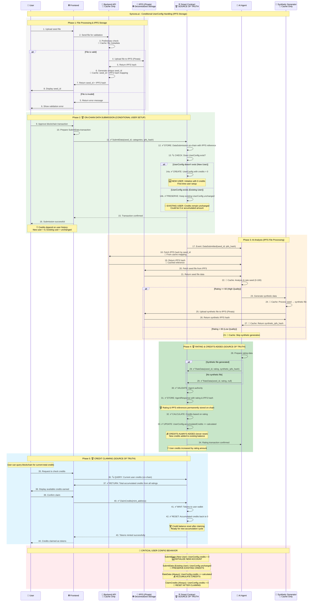

# Sequence Diagram - Conditional UserConfig Interactions

This diagram shows the sequence of interactions between system components with conditional UserConfig handling.

```mermaid
sequenceDiagram
    participant U as 👤 User
    participant F as 🌐 Frontend
    participant B as 🔧 Backend API<br/>💾 Cache Only
    participant IPFS as 📁 IPFS (Pinata)<br/>🌐 Decentralized Storage
    participant SC as ⛓️ Smart Contract<br/>🏆 SOURCE OF TRUTH
    participant A as 🤖 AI Agent
    participant SG as 🧬 Synthetic Generator<br/>💾 Cache Only

    Note over U,SG: Syncora.ai - Conditional UserConfig Handling (IPFS Storage)

    %% Phase 1: File Upload & Validation (IPFS Storage)
    rect rgb(245, 245, 245)
        Note over U,IPFS: Phase 1: File Processing & IPFS Storage
        U->>F: 1. Upload seed file
        F->>B: 2. Send file for validation
        B->>B: 3. Preliminary check<br/>💾 Cache: file metadata
        alt File is valid
            B->>IPFS: 4. Upload file to IPFS (Pinata)
            IPFS->>B: 5. Return IPFS hash
            B->>B: 6. Generate unique seed_id<br/>💾 Cache: seed_id + IPFS hash mapping
            B->>F: 7. Return seed_id + IPFS hash
            F->>U: 8. Display seed_id
        else File is invalid
            B->>F: 5. Return error message
            F->>U: 6. Show validation error
        end
    end

    %% Phase 2: Smart Contract Submission (SOURCE OF TRUTH BEGINS)
    rect rgb(232, 245, 232)
        Note over U,SC: Phase 2: 🏆 ON-CHAIN DATA SUBMISSION (CONDITIONAL USER SETUP)
        U->>F: 9. Approve blockchain transaction
        F->>F: 10. Prepare SubmitData transaction
        F->>SC: 11. ✅ SubmitData(seed_id, categories, ipfs_hash)
        SC->>SC: 12. ✅ STORE: DataSubmission on-chain with IPFS reference
        SC->>SC: 13. 🔍 CHECK: Does UserConfig exist?
        alt UserConfig doesn't exist (New User)
            SC->>SC: 14a. ✅ CREATE: UserConfig with credits = 0
            Note over SC: 🆕 NEW USER: Initialize with 0 credits<br/>First time user setup
        else UserConfig exists (Existing User)
            SC->>SC: 14b. ✅ PRESERVE: Keep existing UserConfig unchanged
            Note over SC: 🔄 EXISTING USER: Credits remain unchanged<br/>Could be 0 or accumulated amount
        end
        SC-->>F: 15. Transaction confirmed
        F-->>U: 16. Submission successful
        Note over U,F: 💡 Credits depend on user history:<br/>New user = 0, Existing user = unchanged
    end

    %% Phase 3: Agent Processing (IPFS File Access)
    rect rgb(255, 243, 224)
        Note over A,SG: Phase 3: AI Analysis (IPFS File Processing)
        SC->>A: 17. Event: DataSubmitted(seed_id, ipfs_hash)
        A->>B: 18. Fetch IPFS hash by seed_id<br/>💾 From cache mapping
        B->>A: 19. Return IPFS hash<br/>💾 Cached reference
        A->>IPFS: 20. Fetch seed file from IPFS
        IPFS->>A: 21. Return seed file data
        A->>A: 22. 💾 Cache: Analyze & rate seed (0-100)
        
        alt Rating >= 60 (High Quality)
            A->>SG: 23. Generate synthetic data
            SG->>SG: 24. 💾 Cache: Process seed → synthetic file
            SG->>IPFS: 25. Upload synthetic file to IPFS (Pinata)
            IPFS->>SG: 26. Return synthetic IPFS hash
            SG->>A: 27. 💾 Cache: Return synthetic_ipfs_hash
        else Rating < 60 (Low Quality)
            Note over A: 23. 💾 Cache: Skip synthetic generation
        end
    end

    %% Phase 4: Rating Submission (CREDITS ALWAYS ADDED)
    rect rgb(200, 230, 201)
        Note over A,SC: Phase 4: 🏆 RATING & CREDITS ADDED (SOURCE OF TRUTH)
        A->>A: 28. Prepare rating data
        alt Synthetic file generated
            A->>SC: 29. ✅ RateData(seed_id, rating, synthetic_ipfs_hash)
        else No synthetic file
            A->>SC: 29. ✅ RateData(seed_id, rating, null)
        end
        
        SC->>SC: 30. ✅ VALIDATE: Agent authority
        SC->>SC: 31. ✅ STORE: AgentResponse with rating & IPFS hash
        Note over SC: 🏆 Rating & IPFS references permanently stored on-chain
        SC->>SC: 32. ✅ CALCULATE: Credits based on rating
        SC->>SC: 33. ✅ UPDATE: UserConfig.accumulatedCredits += calculated
        Note over SC: 💰 CREDITS ALWAYS ADDED (never reset)<br/>New credits added to existing balance
        SC-->>A: 34. Rating transaction confirmed
        Note over SC: 💡 User credits increased by rating amount
    end

    %% Phase 5: User Benefits (Blockchain Authority)
    rect rgb(225, 245, 254)
        Note over U,SC: Phase 5: 🏆 CREDIT CLAIMING (SOURCE OF TRUTH)
        Note over U: User can query blockchain for current total credits
        U->>F: 35. Request to check credits
        F->>SC: 36. 🔍 QUERY: Current user credits (on-chain)
        SC->>F: 37. ✅ RETURN: Total accumulated credits from all ratings
        F->>U: 38. Display available credits earned
        U->>F: 39. Confirm claim
        F->>SC: 40. ✅ ClaimCredits(mint_address)
        SC->>SC: 41. ✅ MINT: Tokens to user wallet
        SC->>SC: 42. ✅ RESET: Accumulated credits back to 0
        Note over SC: 🏆 Credit balance reset after claiming<br/>Ready for new accumulation cycle
        SC-->>F: 43. Tokens minted successfully
        F-->>U: 44. Credits claimed as tokens
    end

    %% Important Credit Flow Clarification
    rect rgb(255, 235, 238)
        Note over U,SG: 🚨 CRITICAL USER CONFIG BEHAVIOR
        Note over SC: SubmitData (New User): UserConfig.credits = 0<br/>🆕 INITIALIZE NEW ACCOUNT
        Note over SC: SubmitData (Existing User): UserConfig unchanged<br/>🔄 PRESERVE EXISTING CREDITS
        Note over SC: RateData (Always): UserConfig.credits += calculated<br/>💰 ACCUMULATE CREDITS
        Note over SC: ClaimCredits (Always): UserConfig.credits = 0<br/>🔄 RESET AFTER CLAIMING
    end
``` 