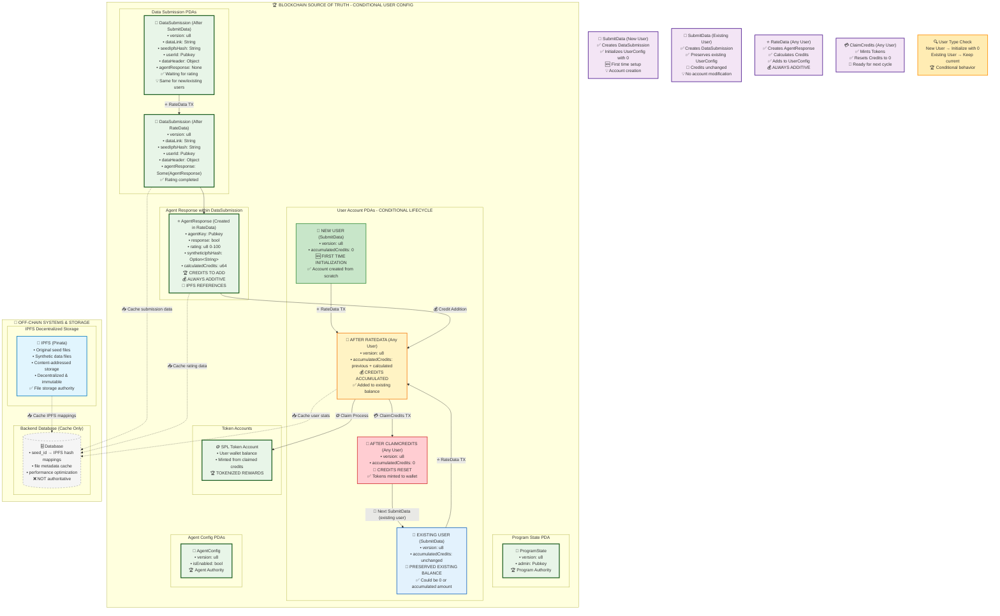

# Data Architecture - Blockchain States & Conditional UserConfig

This diagram shows the blockchain data architecture with different UserConfig states and conditional handling.

```mermaid
graph TB
    subgraph "🏆 BLOCKCHAIN SOURCE OF TRUTH - CONDITIONAL USER CONFIG"
        subgraph "Program State PDA"
            PS["👑 ProgramState<br/>• version: u8<br/>• admin: Pubkey<br/>🏆 Program Authority"]
        end
        
        subgraph "User Account PDAs - CONDITIONAL LIFECYCLE"
            UC1["👤 NEW USER (SubmitData)<br/>• version: u8<br/>• accumulatedCredits: 0<br/>🆕 FIRST TIME INITIALIZATION<br/>✅ Account created from scratch"]
            UC2["👤 EXISTING USER (SubmitData)<br/>• version: u8<br/>• accumulatedCredits: unchanged<br/>🔄 PRESERVED EXISTING BALANCE<br/>✅ Could be 0 or accumulated amount"]
            UC3["👤 AFTER RATEDATA (Any User)<br/>• version: u8<br/>• accumulatedCredits: previous + calculated<br/>💰 CREDITS ACCUMULATED<br/>✅ Added to existing balance"]
            UC4["👤 AFTER CLAIMCREDITS (Any User)<br/>• version: u8<br/>• accumulatedCredits: 0<br/>🔄 CREDITS RESET<br/>✅ Tokens minted to wallet"]
        end
        
        subgraph "Data Submission PDAs" 
            DS1["📄 DataSubmission (After SubmitData)<br/>• version: u8<br/>• dataLink: String<br/>• seedIpfsHash: String<br/>• userId: Pubkey<br/>• dataHeader: Object<br/>• agentResponse: None<br/>✅ Waiting for rating<br/>💡 Same for new/existing users"]
            DS2["📄 DataSubmission (After RateData)<br/>• version: u8<br/>• dataLink: String<br/>• seedIpfsHash: String<br/>• userId: Pubkey<br/>• dataHeader: Object<br/>• agentResponse: Some(AgentResponse)<br/>✅ Rating completed"]
        end
        
        subgraph "Agent Config PDAs"
            AC["🤖 AgentConfig<br/>• version: u8<br/>• isEnabled: bool<br/>🏆 Agent Authority"]
        end
        
        subgraph "Agent Response within DataSubmission"
            AR["⭐ AgentResponse (Created in RateData)<br/>• agentKey: Pubkey<br/>• response: bool<br/>• rating: u8 0-100<br/>• syntheticIpfsHash: Option&lt;String&gt;<br/>• calculatedCredits: u64<br/>🏆 CREDITS TO ADD<br/>💰 ALWAYS ADDITIVE<br/>📁 IPFS REFERENCES"]
        end
        
        subgraph "Token Accounts"
            TOKEN["🪙 SPL Token Account<br/>• User wallet balance<br/>• Minted from claimed credits<br/>🏆 TOKENIZED REWARDS"]
        end
    end

    subgraph "💾 OFF-CHAIN SYSTEMS & STORAGE"
        subgraph "Backend Database (Cache Only)"
            DB[("🗄️ Database<br/>• seed_id → IPFS hash mappings<br/>• file metadata cache<br/>• performance optimization<br/>❌ NOT authoritative")]
        end
        
        subgraph "IPFS Decentralized Storage"
            IPFS["📁 IPFS (Pinata)<br/>• Original seed files<br/>• Synthetic data files<br/>• Content-addressed storage<br/>• Decentralized & immutable<br/>✅ File storage authority"]
        end
    end

    %% Conditional Flow Relationships
    UC1 -->|"⭐ RateData TX"| UC3
    UC2 -->|"⭐ RateData TX"| UC3
    UC3 -->|"💳 ClaimCredits TX"| UC4
    UC4 -->|"📝 Next SubmitData (existing user)"| UC2
    
    DS1 -->|"⭐ RateData TX"| DS2
    DS2 --> AR
    AR -->|"💰 Credit Addition"| UC3
    UC3 -->|"🪙 Claim Process"| TOKEN
    
    %% Cache Relationships (One-way from source of truth)
    UC3 -.->|"📥 Cache user stats"| DB
    DS2 -.->|"📥 Cache submission data"| DB
    AR -.->|"📥 Cache rating data"| DB
    IPFS -.->|"📥 Cache IPFS mappings"| DB
    
    %% Transaction Behavior Annotations
    SUBMIT_NEW["📝 SubmitData (New User)<br/>✅ Creates DataSubmission<br/>✅ Initializes UserConfig with 0<br/>🆕 First time setup<br/>💡 Account creation"]
    SUBMIT_EXISTING["📝 SubmitData (Existing User)<br/>✅ Creates DataSubmission<br/>✅ Preserves existing UserConfig<br/>🔄 Credits unchanged<br/>💡 No account modification"]
    RATE["⭐ RateData (Any User)<br/>✅ Creates AgentResponse<br/>✅ Calculates Credits<br/>✅ Adds to UserConfig<br/>💰 ALWAYS ADDITIVE"]
    CLAIM["💳 ClaimCredits (Any User)<br/>✅ Mints Tokens<br/>✅ Resets Credits to 0<br/>🔄 Ready for next cycle"]
    
    %% User Type Decision
    DECISION["🔍 User Type Check<br/>New User → Initialize with 0<br/>Existing User → Keep current<br/>🏆 Conditional behavior"]
    
    %% Visual Styling
    classDef onchain fill:#e8f5e8,stroke:#1b5e20,stroke-width:3px
    classDef offchain fill:#f5f5f5,stroke:#757575,stroke-width:1px,stroke-dasharray: 5 5
    classDef ipfs fill:#e1f5fe,stroke:#0277bd,stroke-width:2px
    classDef newUser fill:#c8e6c9,stroke:#388e3c,stroke-width:2px
    classDef existingUser fill:#e3f2fd,stroke:#1565c0,stroke-width:2px
    classDef creditsAccumulated fill:#fff3c4,stroke:#f57f17,stroke-width:2px
    classDef creditsReset fill:#ffcdd2,stroke:#d32f2f,stroke-width:2px
    classDef transactions fill:#f3e5f5,stroke:#4a148c,stroke-width:2px
    classDef decision fill:#ffecb3,stroke:#ff8f00,stroke-width:2px
    
    class PS,DS1,DS2,AC,AR,TOKEN onchain
    class DB offchain
    class IPFS ipfs
    class UC1 newUser
    class UC2 existingUser
    class UC3 creditsAccumulated
    class UC4 creditsReset
    class SUBMIT_NEW,SUBMIT_EXISTING,RATE,CLAIM transactions
    class DECISION decision
``` 