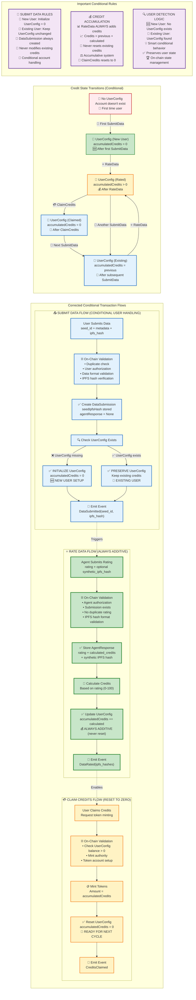

# Transaction Flows - Conditional Rules & Credit States

This diagram shows the corrected conditional transaction flows with detailed rules and credit state transitions.

```mermaid
flowchart LR
    subgraph "Corrected Conditional Transaction Flows"
        subgraph "📤 SUBMIT DATA FLOW (CONDITIONAL USER HANDLING)"
            SD1["User Submits Data<br/>seed_id + metadata + ipfs_hash"]
            SD2["⛓️ On-Chain Validation<br/>• Duplicate check<br/>• User authorization<br/>• Data format validation<br/>• IPFS hash verification"]
            SD3["✅ Create DataSubmission<br/>seedIpfsHash stored<br/>agentResponse = None"]
            SD4["🔍 Check UserConfig Exists"]
            SD5A["✅ INITIALIZE UserConfig<br/>accumulatedCredits = 0<br/>🆕 NEW USER SETUP"]
            SD5B["✅ PRESERVE UserConfig<br/>Keep existing credits<br/>🔄 EXISTING USER"]
            SD6["📡 Emit Event<br/>DataSubmitted(seed_id, ipfs_hash)"]
            
            SD1 --> SD2
            SD2 --> SD3
            SD3 --> SD4
            SD4 -->|"❌ UserConfig missing"| SD5A
            SD4 -->|"✅ UserConfig exists"| SD5B
            SD5A --> SD6
            SD5B --> SD6
        end
        
        subgraph "⭐ RATE DATA FLOW (ALWAYS ADDITIVE)"
            RD1["Agent Submits Rating<br/>rating + optional synthetic_ipfs_hash"]
            RD2["⛓️ On-Chain Validation<br/>• Agent authorization<br/>• Submission exists<br/>• No duplicate rating<br/>• IPFS hash format validation"]
            RD3["✅ Store AgentResponse<br/>rating + calculated_credits<br/>+ synthetic IPFS hash"]
            RD4["🧮 Calculate Credits<br/>Based on rating (0-100)"]
            RD5["✅ Update UserConfig<br/>accumulatedCredits += calculated<br/>💰 ALWAYS ADDITIVE (never reset)"]
            RD6["📡 Emit Event<br/>DataRated(ipfs_hashes)"]
            
            RD1 --> RD2
            RD2 --> RD3
            RD3 --> RD4
            RD4 --> RD5
            RD5 --> RD6
        end
        
        subgraph "💳 CLAIM CREDITS FLOW (RESET TO ZERO)"
            CC1["User Claims Credits<br/>Request token minting"]
            CC2["⛓️ On-Chain Validation<br/>• Check UserConfig balance > 0<br/>• Mint authority<br/>• Token account setup"]
            CC3["🪙 Mint Tokens<br/>Amount = accumulatedCredits"]
            CC4["✅ Reset UserConfig<br/>accumulatedCredits = 0<br/>🔄 READY FOR NEXT CYCLE"]
            CC5["📡 Emit Event<br/>CreditsClaimed"]
            
            CC1 --> CC2
            CC2 --> CC3
            CC3 --> CC4
            CC4 --> CC5
        end
    end
    
    subgraph "Credit State Transitions (Conditional)"
        STATE0["👤 No UserConfig<br/>Account doesn't exist<br/>🚫 First time user"]
        STATE1["👤 UserConfig (New User)<br/>accumulatedCredits = 0<br/>🆕 After first SubmitData"]
        STATE2["👤 UserConfig (Existing)<br/>accumulatedCredits = previous<br/>🔄 After subsequent SubmitData"]
        STATE3["👤 UserConfig (Rated)<br/>accumulatedCredits > 0<br/>💰 After RateData"]
        STATE4["👤 UserConfig (Claimed)<br/>accumulatedCredits = 0<br/>🔄 After ClaimCredits"]
        
        STATE0 -->|"📝 First SubmitData"| STATE1
        STATE1 -->|"⭐ RateData"| STATE3
        STATE3 -->|"💳 ClaimCredits"| STATE4
        STATE4 -->|"📝 Next SubmitData"| STATE2
        STATE2 -->|"⭐ RateData"| STATE3
        STATE3 -->|"📝 Another SubmitData"| STATE2
    end

    subgraph "Important Conditional Rules"
        RULE1["🚨 SUBMIT DATA RULES<br/>📍 New User: Initialize UserConfig = 0<br/>📍 Existing User: Keep UserConfig unchanged<br/>📍 DataSubmission always created<br/>📍 Never modifies existing credits<br/>📍 Conditional account handling"]
        
        RULE2["💰 CREDIT ACCUMULATION<br/>📊 RateData ALWAYS adds credits<br/>📈 Credits = previous + calculated<br/>🧮 Never resets existing credits<br/>⚖️ Accumulative system<br/>🔄 ClaimCredits resets to 0"]
        
        RULE3["🔍 USER DETECTION LOGIC<br/>🆕 New User: No UserConfig exists<br/>🔄 Existing User: UserConfig found<br/>💡 Smart conditional behavior<br/>✅ Preserves user state<br/>🏆 On-chain state management"]
    end

    %% Flow Connections
    SD6 -.->|"Triggers"| RD1
    RD6 -.->|"Enables"| CC1

    %% Visual Styling
    classDef submitFlow fill:#e3f2fd,stroke:#1565c0,stroke-width:2px
    classDef rateFlow fill:#c8e6c9,stroke:#388e3c,stroke-width:3px
    classDef claimFlow fill:#fff3c4,stroke:#f57f17,stroke-width:2px
    classDef noAccount fill:#ffebee,stroke:#c62828,stroke-width:2px
    classDef newUser fill:#c8e6c9,stroke:#388e3c,stroke-width:2px
    classDef existingUser fill:#e3f2fd,stroke:#1565c0,stroke-width:2px
    classDef creditsAwarded fill:#fff3c4,stroke:#f57f17,stroke-width:2px
    classDef creditsReset fill:#ffcdd2,stroke:#d32f2f,stroke-width:2px
    classDef rules fill:#f3e5f5,stroke:#4a148c,stroke-width:2px
    
    class SD1,SD2,SD3,SD4,SD5A,SD5B,SD6 submitFlow
    class RD1,RD2,RD3,RD4,RD5,RD6 rateFlow
    class CC1,CC2,CC3,CC4,CC5 claimFlow
    class STATE0 noAccount
    class STATE1 newUser
    class STATE2,STATE4 existingUser
    class STATE3 creditsAwarded
    class RULE1,RULE2,RULE3 rules
``` 