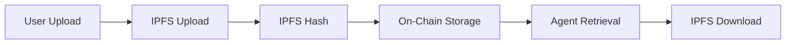

# Syncora.ai System Diagrams - Conditional UserConfig Handling & IPFS Storage

This folder contains comprehensive system diagrams showing the **conditional UserConfig handling** in SubmitData transactions, **IPFS decentralized file storage**, and the complete system architecture.

## 📊 Diagram Overview

All diagrams are available in multiple formats:
- **📄 Markdown (.md)**: Documentation with embedded Mermaid diagrams
- **📁 Mermaid (.mmd)**: Raw Mermaid source files for editing
- **🖼️ SVG (.svg)**: High-quality vector graphics with **high-contrast color schemes**

### **🎨 Color Scheme Features**
- **High Contrast**: Text optimized for readability with dark text on light backgrounds and white text on dark backgrounds
- **Accessibility**: Colors chosen for maximum contrast and accessibility compliance
- **Professional**: Suitable for presentations, documentation, and print materials
- **Consistent**: Unified color palette across all diagrams for visual coherence

### [1. System Flow Chart - Conditional UserConfig Handling](./1-system-flow-conditional-userconfig.md)
**Complete end-to-end flow with conditional logic & IPFS storage**
- Shows the full user journey from file upload to credit claiming
- Highlights conditional UserConfig handling in SubmitData transactions
- Demonstrates IPFS/Pinata integration for decentralized file storage
- Distinguishes between new user initialization and existing user preservation
- Shows blockchain as the authoritative source of truth for financial data

### [2. Sequence Diagram - Conditional UserConfig Interactions](./2-sequence-diagram-conditional-interactions.md)
**Timeline of component interactions with conditional behavior & IPFS**
- Phase-by-phase breakdown of system interactions
- Shows IPFS file upload/retrieval operations
- Demonstrates conditional UserConfig creation vs preservation
- Emphasizes on-chain vs off-chain vs IPFS responsibilities
- Shows accumulative credit system with IPFS references

### [3. Data Architecture - Blockchain States & Conditional UserConfig](./3-data-architecture-blockchain-states.md)
**Blockchain data structure, state transitions & IPFS integration**
- Shows all PDA structures with IPFS hash storage
- Illustrates different UserConfig states throughout the lifecycle
- Demonstrates conditional state transitions
- Highlights on-chain authority vs off-chain caching vs IPFS storage
- Shows decentralized file storage architecture

### [4. Transaction Flows - Conditional Rules & Credit States](./4-transaction-flows-conditional-rules.md)
**Detailed transaction logic with business rules & IPFS references**
- Breaks down each transaction type (SubmitData, RateData, ClaimCredits)
- Shows IPFS hash validation and storage
- Demonstrates conditional branching logic and decision points
- Explains credit state transitions and accumulation rules
- Provides clear business rule documentation with file storage

## 🔄 Key Conditional Behaviors

### **SubmitData Transaction (Conditional UserConfig Handling)**
```rust
// Conditional behavior based on user history
IF UserConfig doesn't exist (NEW USER):
  → Initialize UserConfig with accumulated_credits = 0
  → Account creation for first-time user

IF UserConfig exists (EXISTING USER):
  → Keep UserConfig unchanged
  → Preserve existing credit balance
  → No modification of existing credits
```

### **RateData Transaction (Always Accumulative)**
```rust
// Credits are ALWAYS added (never reset)
UserConfig.accumulated_credits += calculated_credits
// Preserves existing balance and adds new credits
```

### **ClaimCredits Transaction (Reset to Zero)**
```rust
// Reset credits after minting tokens
UserConfig.accumulated_credits = 0
// Ready for next accumulation cycle
```

## 📁 IPFS Decentralized File Storage

### **File Storage Architecture**
- **Seed Files**: Uploaded to IPFS (Pinata) during initial submission
- **Synthetic Files**: Generated and uploaded to IPFS after rating
- **IPFS Hashes**: Stored on-chain as immutable references
- **Content Addressing**: Files accessed by cryptographic hash
- **Decentralization**: No single point of failure for file storage

### **IPFS Integration Flow**


## 💡 Critical Design Principles

### **1. 🏆 Blockchain as Source of Truth**
- All financial data (credits, ratings) stored on-chain
- IPFS hashes stored on-chain as immutable file references
- Off-chain systems are cache/convenience only
- No authoritative financial data stored off-chain

### **2. 📁 Decentralized File Storage**
- All files stored on IPFS for decentralization and immutability
- Content-addressed storage prevents file tampering
- Pinata provides reliable IPFS pinning service
- On-chain IPFS hash references ensure file integrity

### **3. 🔄 Conditional User Management**
- Smart detection of new vs existing users
- Preserves existing user state and credits
- No accidental credit loss during data submission

### **4. 💰 Accumulative Credit System**
- Credits build up over multiple ratings
- Never reset existing credits (except during claim)
- User-friendly progressive rewards

### **5. 🛡️ Immutable Audit Trail**
- All transactions permanently recorded on blockchain
- IPFS hashes provide immutable file references
- Complete transparency and verifiability
- Source of truth for all critical operations

## 🎯 User Experience Benefits

- **🆕 New Users**: Seamless onboarding with clear zero-credit start
- **🔄 Existing Users**: Credits preserved across multiple submissions
- **💰 Accumulative Rewards**: Credits build up over time from quality data
- **📁 Decentralized Storage**: Files stored on IPFS for permanence and availability
- **🎨 High Contrast**: Excellent text readability in all viewing conditions
- **♿ Accessible Design**: Color schemes meet accessibility standards
- **🏆 Transparent**: All credit decisions and file references visible on blockchain
- **🔒 Secure**: Financial logic enforced by smart contract, files protected by IPFS
- **🌐 Censorship Resistant**: IPFS ensures files remain accessible globally

## 🚀 Implementation Status

These diagrams reflect the **current corrected behavior** where:
- ✅ SubmitData conditionally handles UserConfig (new vs existing)
- ✅ RateData always accumulates credits
- ✅ ClaimCredits resets to zero
- ✅ Blockchain maintains authoritative financial state
- ✅ IPFS provides decentralized file storage
- ✅ IPFS hashes stored on-chain for immutable file references
- ✅ Off-chain systems cache only (no authoritative data)

## 📖 Usage

To view the diagrams:

### **📄 Markdown Files (.md)**
- View directly in GitHub, VS Code, or any Markdown viewer
- Contains documentation and embedded Mermaid diagrams
- Best for reading and understanding the system

### **🖼️ SVG Files (.svg)**
- High-quality vector graphics suitable for:
  - Presentations and documentation
  - Embedding in websites or applications
  - Printing without quality loss
  - Professional reports and whitepapers
- **🎨 High-Contrast Design**: Optimized text contrast for excellent readability
- **🌐 Universal Compatibility**: White background works in any context
- **♿ Accessibility**: Color choices meet accessibility standards

### **�� Mermaid Files (.mmd)**
- Raw Mermaid source code for editing
- Can be converted to other formats using [Mermaid CLI](https://github.com/mermaid-js/mermaid-cli)
- Edit in [Mermaid Live Editor](https://mermaid.live/)

### **🔄 Converting Formats**
To regenerate SVG files from Mermaid source:
```bash
# Install Mermaid CLI (if not already installed)
npm install -g @mermaid-js/mermaid-cli

# Convert individual diagrams with high-contrast white background
mmdc -i 1-system-flow-conditional-userconfig.mmd -o 1-system-flow-conditional-userconfig.svg -t default -b white

# Convert all diagrams with optimized settings
for file in *.mmd; do
  mmdc -i "$file" -o "${file%.mmd}.svg" -t default -b white
done
```

Each diagram is self-contained and includes styling for clear visual distinction between different components and flows. 